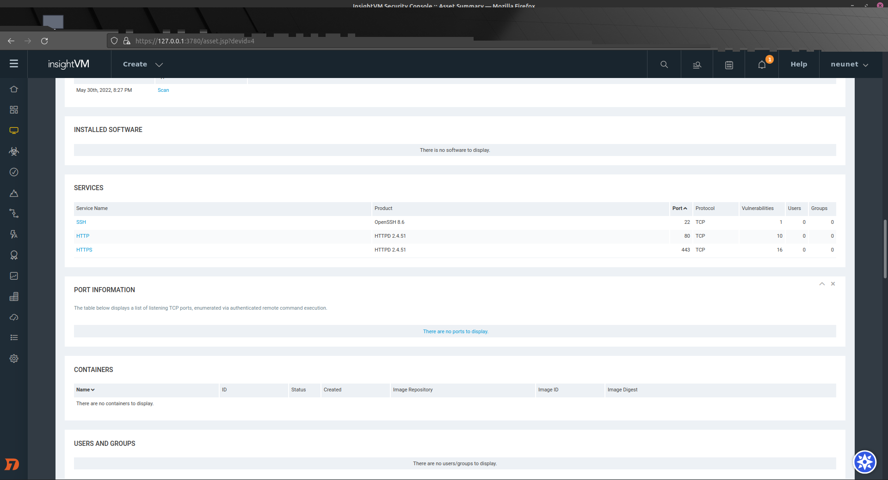
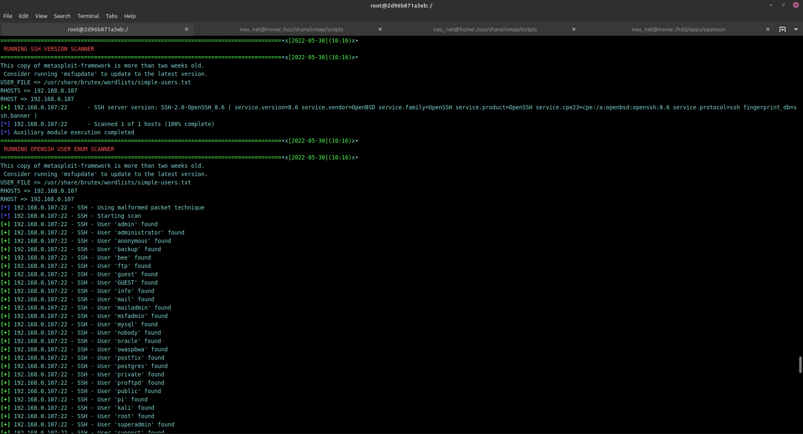

## 1. HTB

### 1.1 Nessus

### 1.2 Nexpose

### 1.3 Sniper

## 2. Metasplotable3_linux

### 2.1 Nessus
/nessus/nessus_1.png)
/nessus/nessus_2.png)
/nessus/nessus_3.png)
/nessus/nessus_4.png)
/nessus/nessus_5.png)
### 2.2 Nexpose
/nexpose/nexpose_1.png)
/nexpose/nexpose_2.png)
/nexpose/nexpose_3.png)
/nexpose/nexpose_4.png)
/nexpose/nexpose_5.png)
/nexpose/nexpose_6.png)
### 2.3 Nmap
/nmap/nmap_1.png)
/nmap/nmap_2.png)
/nmap/nmap_3.png)
/nmap/nmap_4.png)
### 2.4 Sniper
/sniper/sniper_1.png)
/sniper/sniper_2.png)
/sniper/sniper_3.png)
/sniper/sniper_4.png)
/sniper/sniper_5.png)
/sniper/sniper_6.png)
/sniper/sniper_7.png)
/sniper/sniper_8.png)
/sniper/sniper_9.png)
/sniper/sniper_10.png)
## 3. Metasplotable3_windows
/screamer_1.png)
### 3.1 Nessus
/nessus/nessus_1.png)
/nessus/nessus_2.png)
/nessus/nessus_3.png)
/nessus/nessus_4.png)
/nessus/nessus_5.png)
/nessus/nessus_6.png)
### 3.2 Nexpose
/nexpose/nexpose_1.png)
/nexpose/nexpose_2.png)
/nexpose/nexpose_3.png)
/nexpose/nexpose_4.png)
### 3.3 Nmap
/nmap/nmap_1.png)
/nmap/nmap_2.png)
/nmap/nmap_4.png)
/nmap/nmap_3.png)
### 3.4 Sniper
/sniper/sniper_1.png)
## 4. Vulnhub

### 4.1 Nessus

### 4.2 Nexpose

### 4.3 Nmap

### 4.4 Sniper

